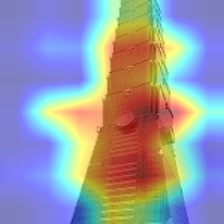
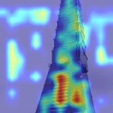
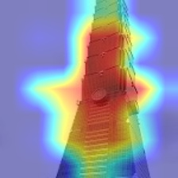
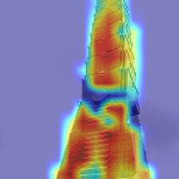

# Comparison and Analysis of Vision Transformer Variants
Last year, ChatGPT successfully captured public attention, and now we are anticipating the arrival of the next generation. Our research analyzes two Transformer-based backbones, Vision Transformer and Swin Transformer, identify the optimal architecture for computer vision tasks. We aim to demonstrate how Transformers can be applied to vision problems and to understand the reasoning behind the network’s decisions.

## Project Page
Please visit our project page! It documents our learning process, the challenges we encountered, and how we addressed them. We hope you enjoy exploring it.\
[Comparison and Analysis of Vision Transformer Variants](https://sites.google.com/view/project666/home)

## System Environment  
   * python 3.9
   * Pytorch 2.0.1
   * CUDA 11.7

## Vision Transformer Variants
* Vision Transformer\
The Vision Transformer (ViT) is a model that splits an image into small patches and processes them as a sequence, allowing the model to focus on information from different parts of the image. This approach also removes the fixed input size constraint typically found in traditional convolutional neural networks.\
Our implementation is based on the [GitHub - WZMIAOMIAO ViT](https://github.com/WZMIAOMIAO/deep-learning-for-image-processing/tree/master/pytorch_classification/vision_transformer). Many thanks to the author for their excellent work!

* Swin Transformer\
The Swin Transformer is an improved version of ViT that uses a Shifted Window mechanism to process images. This technique helps the model better capture information from various regions of the image while reducing computational and memory costs.\
Official implementation: [GitHub - Swin Transformer (Microsoft)](https://github.com/microsoft/Swin-Transformer)\
Example code: [GitHub - WZMIAOMIAO Swin](https://github.com/WZMIAOMIAO/deep-learning-for-image-processing/tree/master/pytorch_classification/swin_transformer)
 
## Visualization tools
Grad-CAM and Score-CAM are visualization techniques that help us understand how neural networks make decisions and which parts of the image they focus on.
Our implementation is based on the excellent tutorial provided in [jacobgil/pytorch-grad-cam](https://github.com/jacobgil/pytorch-grad-cam/blob/master/tutorials/vision_transformers.md)

## Visualization Results
The heatmaps below show which parts of the image the models focus on, using Grad-CAM and Score-CAM for both the Swin Transformer and Vision Transformer

|               | **Swin**        | **ViT**         |
|---------------|----------------|-----------------|
| **Grad-CAM**  |  |  |
| **Score-CAM** |  |  |

We found that Swin Transformer shows better localization consistency across both Grad-CAM and Score-CAM, while Vision Transformer tends to produce more scattered feature maps. Also, Grad-CAM adds more noise in the background, while Score-CAM gives a cleaner and more accurate focus.
